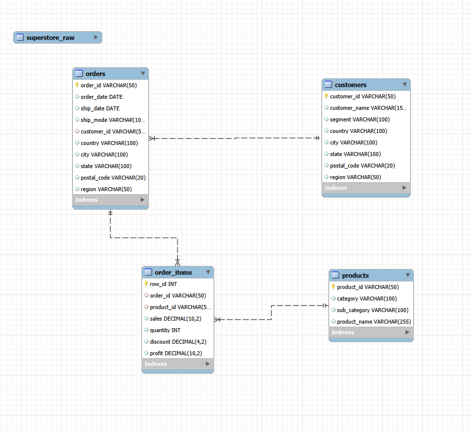

# Superstore Sales Analysis using SQL

## Project Overview

This project analyzes retail sales performance using SQL and the **Superstore dataset**.

The objective of this project was to transform raw transactional data into a **structured relational database** and perform business analysis using SQL queries.

The project demonstrates how a raw dataset can be:

- structured into a relational database
- normalized into multiple tables
- analyzed using SQL to generate business insights

All financial values in this project are expressed in **USD ($)** because the dataset represents U.S. retail transactions.

---

## Business Problem

Retail companies generate large volumes of transactional data but often struggle to extract meaningful insights from it.

This project aims to answer several key business questions:

- What are the overall revenue, profit, and profit margin?
- Which product categories generate the most revenue and profit?
- How have sales evolved over time?
- Which customers contribute the most to total sales?
- Which regions are the most profitable?
- Which product sub-categories drive the most revenue?

Understanding these patterns helps businesses improve decision-making and optimize sales strategies.

---

## Dataset

The analysis uses the **Superstore dataset**, a retail dataset containing transactional sales data.

Each record represents a product sold within an order and includes:

- order information
- customer information
- product information
- sales metrics (sales, quantity, discount, profit)

---

## Database Design

The original dataset contains all information in a **single flat table**.

To improve data organization and support relational analysis, the dataset was **normalized into multiple tables**.

The database was designed using the following tables:

### customers

| Column | Description |
|------|------|
| customer_id | Unique identifier for each customer |
| customer_name | Customer name |
| segment | Customer segment |
| country | Country |
| city | City |
| state | State |
| postal_code | Postal code |
| region | Geographic region |

---

### orders

| Column | Description |
|------|------|
| order_id | Unique order identifier |
| order_date | Date the order was placed |
| ship_date | Shipping date |
| ship_mode | Shipping method |
| customer_id | Customer reference |

---

### products

| Column | Description |
|------|------|
| product_id | Unique product identifier |
| category | Product category |
| sub_category | Product sub-category |
| product_name | Product name |

---

### order_items

| Column | Description |
|------|------|
| row_id | Unique row identifier |
| order_id | Order reference |
| product_id | Product reference |
| sales | Sales amount |
| quantity | Quantity sold |
| discount | Discount applied |
| profit | Profit generated |

---

## Database Schema

The relational structure of the database is shown below.

The schema defines relationships between customers, orders, products, and order items using **primary and foreign key relationships**.

---

## Data Preparation

Before performing the analysis, the dataset was processed using several steps:

- Imported raw data into a staging table (`superstore_raw`)
- Converted text date fields into SQL date format
- Normalized the dataset into relational tables
- Created primary and foreign key relationships
- Verified table integrity using record counts

This process simulates a simplified **ETL workflow** commonly used in data analytics projects.

---

## SQL Analysis

Several analytical queries were performed to understand business performance.

The detailed queries and results are documented in the file **`analysis_description`**

----

## Key Business Insights
The analysis reveals several important patterns:

- Technology generates the highest revenue and profit.
- Sales increased significantly in later years compared to earlier periods.
- The **West region**  is the strongest contributor to revenue and profit.
- A small number of customers generate a significant share of total sales.
- Some product sub-categories contribute disproportionately to total revenue.
- Some high-revenue products (such as Tables) are not profitable.
- Profitability varies significantly across product categories and regions.

--- 

## Business Recommendations

Based on the analysis, several actions could help improve performance:

- Focus marketing and inventory strategies on high-performing product categories.
- Develop retention strategies for high-value customers.
- Monitor regional performance to identify operational inefficiencies.
- Carefully manage discount strategies to maintain healthy profit margins.

---

## Tools Used

- MySQL
- MySQL Workbench
- SQL (SELECT,JOIN, GROUP BY, CASE, aggregation functions)

---

## Files in This Repository

- **Superstore_Raw_Data.csv** — original dataset  
- **superstore_analysis.sql** — data modeling and business analysis queries  
- **superstore_database_schema.PNG** — EER database diagram  
- **analysis_description** — description of the analytical queries and results  

---

## Future Improvements

Possible extension of this project includes :
- Building a **Power BI dashboard connected to the SQL database**
- Using **Python** (Pandas / Matplotlib) for advanced analysics

---

##Author
**Ariane Sime**
Business Informatics Student (**Wirtschaftsinformatik B.Sc.**)
Aspiring Data Analyst

---

